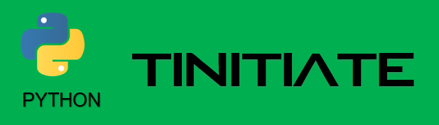

# PYTHON OBJECT ORIENTED PROGRAMMING OOP CLASS INHERITANCE
* Inheritance, is the process of accessing Functions and Members of a
  class from another class.
* Here the CLASS whose Functions and Members need to be accessed is called the 
  Parent Class and the CLASS that accessing is called the Child Class.
* To Inherit parent class functions and variables, pass the parent class name 
  as a parameter to child class.
* Now a child class object can access the parent class functions and variables
* Inheritance can be implemented as multiple Inheritance,
  multi-level Inheritance.
* Inheritance Method Overriding
* Inheritance using SUPER
* Private variables,Note there is no Private functions / methods in PYTHON
```python
# Inheritance demo, with one parent class and one child class
# Create a PARENT class, which will be inherited by a child class
class ParentClass():
    Parentvar1 = "parentVariable Value"
    def parentFunction(self):
        print("This is a message from ParentClass.parentFunction")

#This is a clhld class that inherits ParentClass,
# SYNTAX is to call the parent class as a parameter to the child class
class ChildClass(ParentClass):
    ChildVar1 = "parentVariable Value"
    def childFunction(self):
        print("This is a message from ChildClass.childFunction")

# Create an object of the Child Class
cObj = ChildClass()

# CALL CHILDCLASS and PARENTCLASS methods from the child object
cObj.childFunction()
cObj.parentFunction()
```

## Multiple Inheritance
* Here we demonstrate Multiple Inheritance, Which is multiple parent classes 
  and one child class
```python
#Create one more parent class, to demonstrate multiple parent inheritance
class Parent_1():
    "This is another parent-level class"

    def Parent1Function(self):
        print("This is a message from the Parent_1.Parent1Function")

class Parent_2():
    "This is another parent-level class"

    def Parent2Function(self):
        print("This is a message from the Parent_2.Parent2Function")

# Class that inherits from 2 parents
class ChildMI(Parent_1, Parent_2):
    "This is the ChildMI, this inherits Parent_1 and Parent_2"

    def ChildMIFunction(self):
        print("This is a message from the ChildMI.ChildMIFunction")

# Create ChildMI Object
gcObj = ChildMI()
gcObj.Parent1Function()
gcObj.Parent2Function()
```

## Multi-Level Inheritance
* Here we demonstrate Mult-Level Inheritance, Which is The Inheritance is 
  across multiple classes where in A Child Class Inherits from a Parent Class,
  and the Parent Class inherits from a Grand parent Class
```python
#Create one more parent class, to demonstrate multiple parent inheritance
class GrandParent():
    "This is the GrandParent class"
    def GrandParentFunction(self):
        print("This is a message from the GrandParent.GrandParentFunction")

# This inherits the GrandParent class
class Parent(GrandParent):
    "This is the Parent class"
    def ParentFunction(self):
        print("This is a message from the Parent.ParentFunction")

# Class that inherits Parent Class
class Child(Parent):
    "This is the ChildMI, this inherits Parent_1 and Parent_2"
    def ChildFunction(self):
        print("This is a message from the Child.ChildFunction")

# Create ChildMI Object
gcObj = Child()

gcObj.GrandParentFunction()
gcObj.ParentFunction()
gcObj.ChildFunction()
```

## Inheritance Overriding
* Overriding is all about NAMES of Functions and Variables.
* Overriding is the process of using the same NAME for Functions and variables, 
  In the child class, which inherits same named Functions and variables from
  a parent class.
* Here the Child Functions and variables, with same names takes precedence over
  the Inherited Parent Class Functions and Variables
```python
#Demonstration of OverRiding
class xParent():  # Create a Parent Class
    "This is a Parent Class"
    var1 = "Parent-Test"
    def func1(self):
        print("This is parent class")

# Child class that inherits the xParent
# and uses the names same as the ones from the parent class
class xChild(xParent):
    "This is the Child class"
    var1 = "Child-Test"
    def func1(self):
        print("This is child class")

objA = xChild()
objA.func1()    # This should print message from the child class
```

## Inheritance super function
* SUPER is useful for accessing inherited methods from parent class
  that have been overridden in the child class.
* Here we use the `super` keyword, Pass the Child Class Name and call the 
  parent class's function
```python
# ###########################
# Parent Class with a method
# ###########################
class Parent1():
    "A parent class to demonstrate the SUPER"
    
    # Parent1 Class Variable
    X = 100
    
    # Parent1 Consructor
    def __init__(self):
        print("This is a message from ",Parent1.__name__)
    
    # Parent1 Method
    def func1(self):
        print("This is a message from Parent1.func1")

# ##########################
# Child Class with a method
# ##########################
class Child1(Parent1):
    "A child class to demonstrate the SUPER"
    
    # Child1 Class Variable
    X = 999
    
    # Child1 Consructor
    def __init__(self):
    
        # Call the parent Classes Constructor using the super()
        super().__init__()
        
        # Refer the variable X from Parent1 Class using super()
        print(super().X)

        # Refer the variable X from Child1 Class
        print(self.X)
    
    def func1(self):
        print("This is a message from Child1.func1")
        
    # This is a func2, calling the Parent1 classes method.
    def func2(self):
        super().func1()

# Create an objec to demonstrate SUPER()
print(1240)
supObject = Child1()
supObject.func1()
supObject.func2()
```

## Class Private Variables
* Private Variables are variables that cannot be accessed outside the class.
* Create Private variables using a double underscore ( _ ) prefix
  for the variable names.
```python
class private_test():
    "This is a class to demonstrate the Private variables"
    __private_var1 = "This is a Private Value"

    public_var = "This is a public value"

# Create an object of the provate_test class
ObjPrv = private_test()

# The following code throws an error as the private variable
# is not accessible from outside the class
# print(ObjPrv.__private_var1)

# print the public variable of the class
print(ObjPrv.public_var)
```

* * *
| (c) TINITIATE / Venkata Bhattaram |
| :--- |